# crack-manim

## LEVEL UP on Manim Animation Library Fast

---

### **Section 1: Introduction to Manim and Basic Concepts**

1. **Hello World** - [Hello world in Manim](./tasks/S1.1_hello_world.py)  

2. **Basic Shapes and Text** – [Introduction to basic geometric objects](./tasks/S1.2_basic_shapes.py)  

3. **Basic Animation** – [Animating a simple shape's position, scale, and rotation](./tasks/S1.3_basic_animation.py)  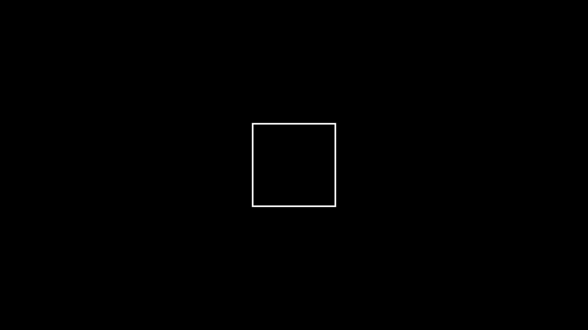

4. **Understanding the Scene** – [Exploring the `Scene` class, its components, and structure](./tasks/S1.4_understanding_scene.py)  

5. **Basic Transitions** – [Using `play()` to create smooth transitions between animations](./tasks/S1.5_basic_transitions.py)  

6. **Updaters and Continuous Animations** – [Introduction to updaters and continuous object motion](./tasks/S1.6_updaters_continuous_animations.py)  

7. **Camera Movements** – [Basic camera movements: panning, zooming](./tasks/S1.7_camera_movements.py)  

8. **Simultaneous Animations** – [Creating simultaneous animations with multiple objects](./tasks/S1.8_simultaneous_animations.py)  

9. **Animating Multiple Objects** – [Managing multiple objects and synchronizing animations](./tasks/S1.9_animating_multiple_objects.py)  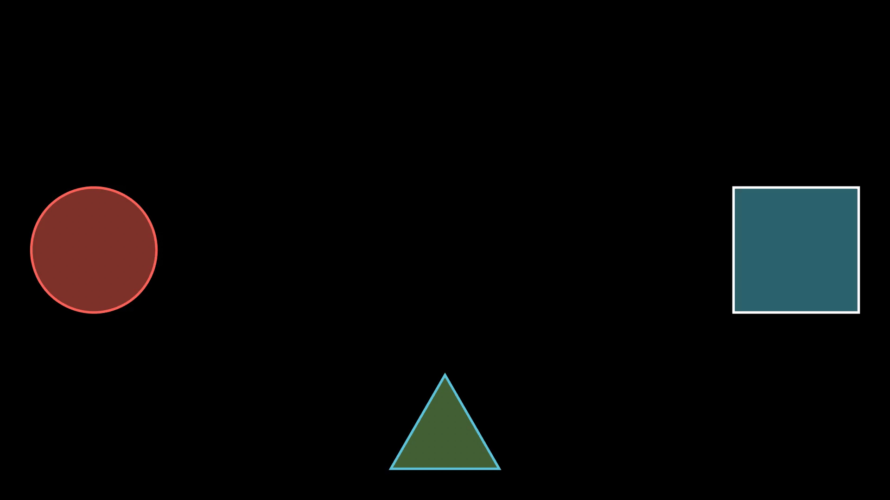

10. **Customizing Text Animations** – [Animating text objects with effects like typing and fading](./tasks/S1.10_customizing_text_animations.py)  

---

### **Section 2: Intermediate Transformations and Animation Techniques**

1. **Transformations and Morphing** – [Using `transform()` for shape morphing](./tasks/S2.1_transformations_morphing.py)  

2. **Complex Path Animations** – [Moving objects along paths: straight lines and curves](./tasks/S2.2_complex_path_animations.py)  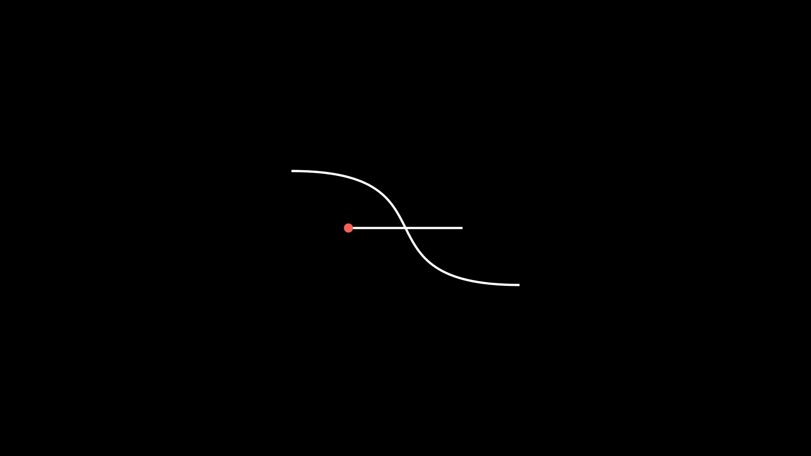

3. **Color Transitions** – [Animating color changes on objects](./tasks/S2.3_color_transitions.py)  

4. **Easing Functions** – [Applying easing functions for smoother animations](./tasks/S2.4_easing_functions.py)  

5. **Advanced Camera Work** – [Applying camera zooms, rotations, and following paths](./tasks/S2.5_advanced_camera_work.py)  

6. **Animating Multiple Layers** – [Using multiple layers and managing different objects in the scene](./tasks/S2.6_animating_multiple_layers.py)  

7. **Creating Complex Transitions** – [Combining multiple animations and transitions](./tasks/S2.7_creating_complex_transitions.py)  

8. **Animating with Time** – [Creating time-based animations using `ValueTracker`](./tasks/S2.8_animating_with_time.py)  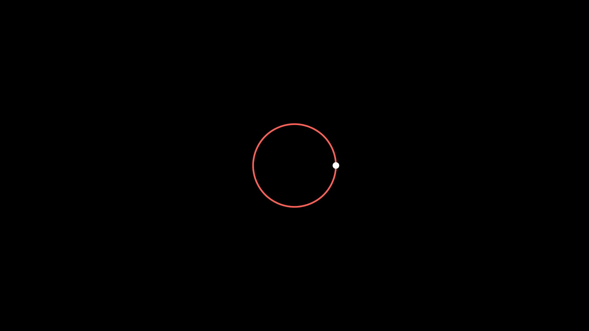

9. **Animating Multiple Texts** – [Synchronizing multiple blocks of text with animations](./tasks/S2.9_animating_multiple_texts.py)  

10. **Grouping Objects** – [Using `VGroup` and managing multiple objects as a group](./tasks/S2.10_grouping_objects.py)  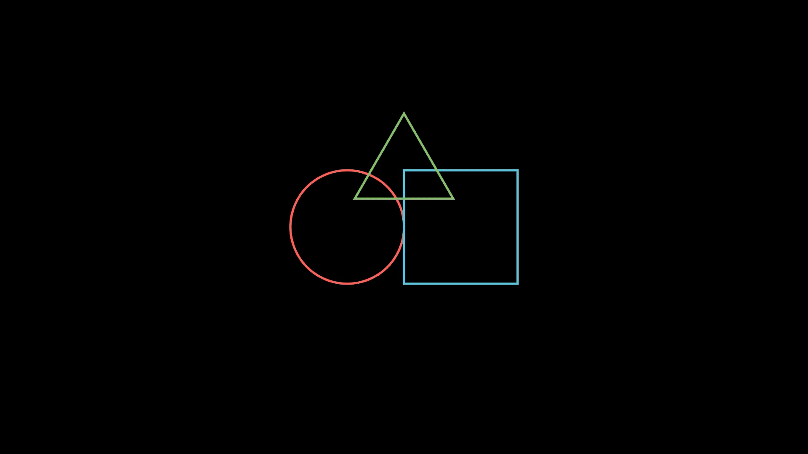

---

### **Section 3: Physics Simulations Basics**

1. **Basic Physics Concepts** – [Introduction to physics in ManimGL: velocity, acceleration](./tasks/S3.1_basic_physics_concepts.py)  

2. **Free Fall Animation** – [Simulating an object in free fall with gravity](./tasks/S3.2_free_fall_animation.py)  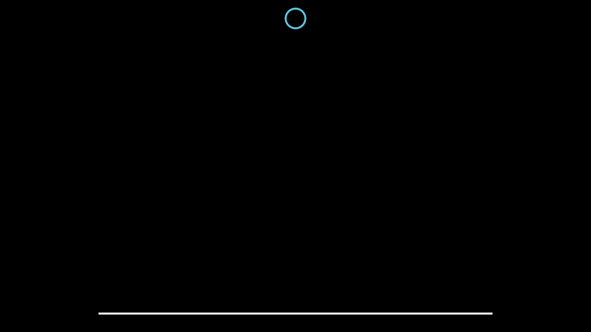

3. **Bouncing Balls** – [Animating balls bouncing off surfaces (elastic collision)](./tasks/S3.3_bouncing_balls.py)  

4. **Projectile Motion** – [Simulating projectiles under the influence of gravity](./tasks/S3.4_projectile_motion.py)  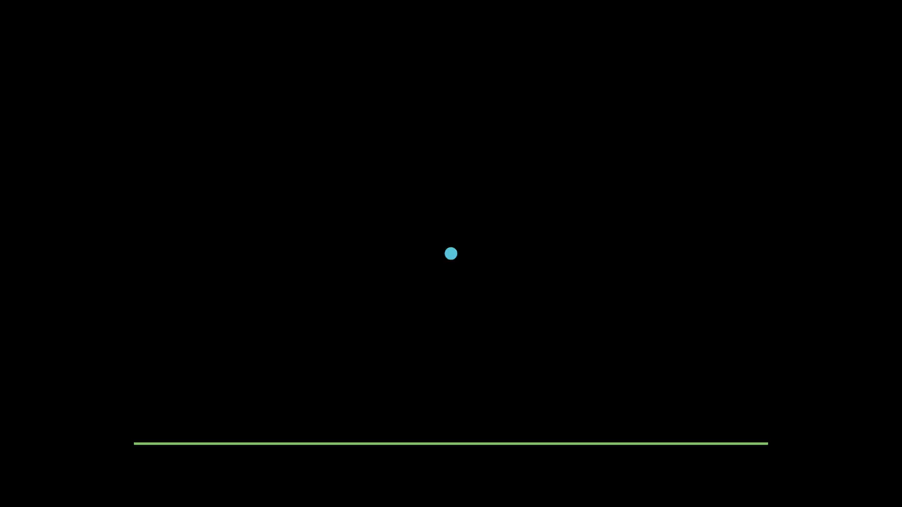

5. **Pendulum Motion** – [Animating the motion of a pendulum](./tasks/S3.5_pendulum_motion.py)  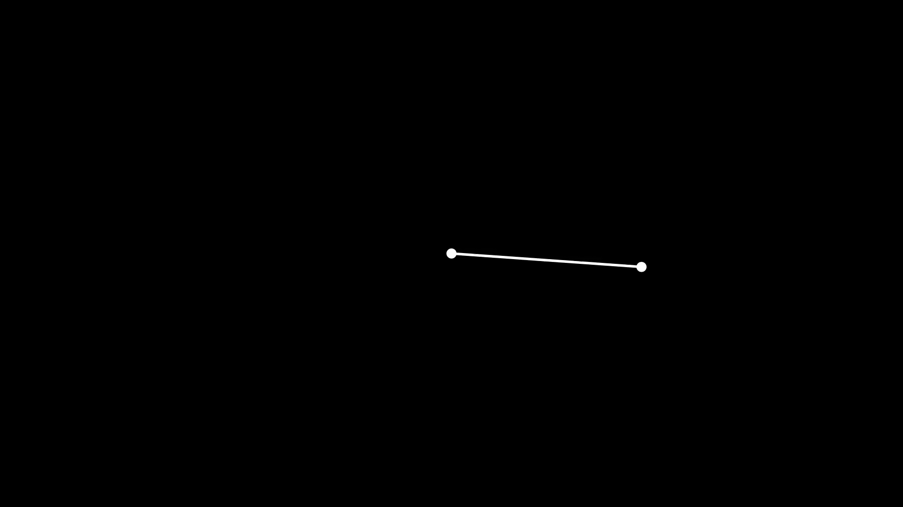

6. **Simple Harmonic Motion** – [Simulating simple harmonic oscillations](./tasks/S3.6_simple_harmonic_motion.py)  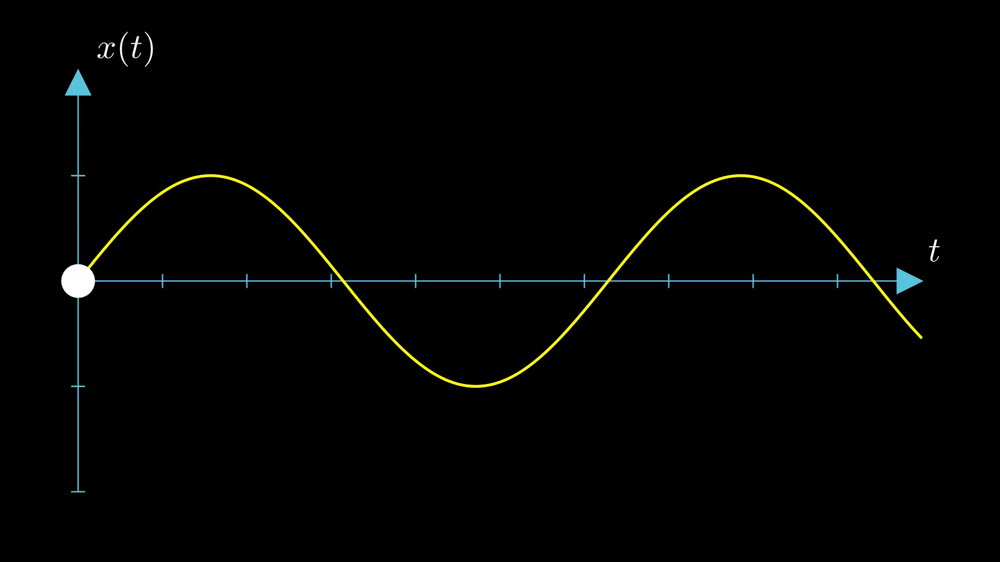

7. **Ball Rolling Down a Hill** – [Simulating motion with friction and gravity](./tasks/S3.7_ball_rolling_down_hill.py)  

8. **Elastic Collisions** – [Simulating elastic collisions between two objects](./tasks/S3.8_elastic_collisions.py)  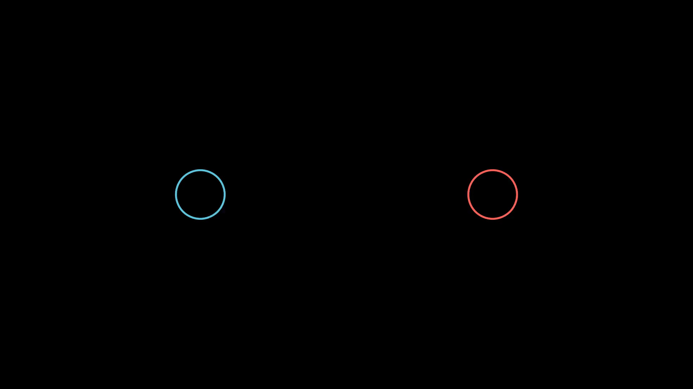

9. **Spring Oscillation** – [Animating a spring's extension and compression](./tasks/S3.9_spring_oscillation.py)  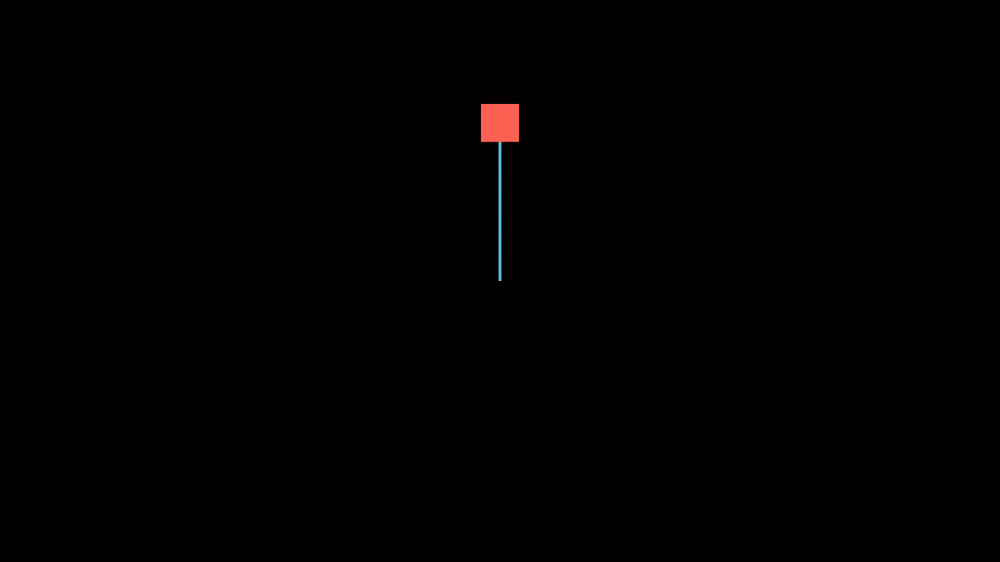

10. **Visually Simulating Forces** – [Showing force vectors acting on objects](./tasks/S3.10_visually_simulating_forces.py)  

---

### **Section 4: Advanced Physics Simulations**

1. **Newtonian Gravity** – [Simulating gravitational forces and orbits](./tasks/S4.1_newtonian_gravity.py)  

2. **Fluid Dynamics Simulation** – [Basic fluid simulations using particle systems](./tasks/S4.2_fluid_dynamics_simulation.py)  

3. **Rocket Launch with Air Resistance** – [Simulating a rocket launch with drag forces](./tasks/S4.3_rocket_launch_with_air_resistance.py)  

4. **Magnetic Forces** – [Visualizing magnetic fields and their interactions](./tasks/S4.4_magnetic_forces.py)  

5. **Planetary Orbits** – [Animating planetary motion using Kepler’s laws](./tasks/S4.5_planetary_orbits.py)  

6. **Collision of Two Objects** – [Simulating the collision between two objects with velocity changes](./tasks/S4.6_collision_of_two_objects.py)  

7. **Electromagnetic Waves** – [Visualizing the propagation of electromagnetic waves](./tasks/S4.7_electromagnetic_waves.py)  

8. **Wave Propagation** – [Simulating wave behavior: reflection, refraction](./tasks/S4.8_wave_propagation.py)  

9. **Friction in Motion** – [Demonstrating the effects of friction on object motion](./tasks/S4.9_friction_in_motion.py)  

10. **Viscosity and Fluid Flow** – [Simulating the movement of particles in a viscous fluid](./tasks/S4.10_viscosity_and_fluid_flow.py)  

---

### **Section 5: Visualizing Mathematical Concepts**
1. **Graphs and Functions** – Plotting simple mathematical functions (e.g., sin, cos).
2. **Visualizing Derivatives** – Showing the derivative of a function.
3. **Integral Visualization** – Visualizing areas under curves using integration.
4. **Animating Parametric Curves** – Plotting parametric equations in 2D and 3D.
5. **Polar Coordinates** – Animating objects in polar coordinates.
6. **Transforming Geometric Figures** – Exploring coordinate transformations.
7. **Plotting a Surface** – Animating 3D surfaces and shapes.
8. **Animating a Complex 3D Curve** – Showing parametric 3D curve animations.
9. **Color Mapping on a Surface** – Visualizing functions with color gradients.
10. **Vector Field Visualization** – Visualizing vector fields and flow lines.

---

### **Section 6: Advanced 3D Animations**
1. **Introduction to 3D Objects** – Basic 3D objects: Cube, Sphere, Torus.
2. **Animating in 3D Space** – Basic 3D transformations (rotation, scaling).
3. **Camera in 3D Space** – Moving the camera in three dimensions.
4. **Animating in 3D Paths** – Moving objects along 3D paths.
5. **Complex 3D Scene Creation** – Designing more complex 3D scenes.
6. **Creating 3D Graphs** – Visualizing 3D mathematical graphs.
7. **3D Object Interactions** – Objects interacting in 3D (e.g., collisions).
8. **Advanced 3D Camera Movement** – Smooth 3D camera animations and rotations.
9. **Lighting and Shadows in 3D** – Setting up lighting and shadows in 3D scenes.
10. **Advanced 3D Transitions** – Creating complex 3D scene transitions.

---

### **Section 7: Advanced Animation Techniques**
1. **Path Animations with Curves** – Animating objects along Bezier curves.
2. **Animating with Randomness** – Introducing randomness into object motion.
3. **Multiple Timelines in Animation** – Managing multiple timelines and synchronizing animations.
4. **Animating Custom Curves** – Drawing and animating custom curves in scenes.
5. **Time-Lapse Animations** – Creating time-lapse effects for animations.
6. **Interactive Animation** – Creating basic user-interactive animations.
7. **Sound Integration** – Synchronizing animations with background music.
8. **Particle Systems** – Using particles to create effects like smoke, fire, etc.
9. **Advanced Easing Techniques** – Implementing complex easing for smooth animations.
10. **Creating Custom Animators** – Writing your own custom animation functions.

---

### **Section 8: Neural Networks and Data Visualizations**
1. **Introduction to Neural Networks** – Visualizing a simple feedforward neural network.
2. **Training a Neural Network** – Simulating neural network training with visual updates.
3. **Visualizing Loss Function** – Animating the loss function evolution during training.
4. **Backpropagation in Action** – Visualizing backpropagation in a neural network.
5. **Neural Network Weights** – Showing weight updates during training.
6. **Animating Activation Functions** – Visualizing different activation functions in action.
7. **Decision Boundaries in Neural Networks** – Visualizing how neural networks classify data.
8. **Convolutional Neural Networks** – Visualizing CNN operations on images.
9. **Recurrent Neural Networks (RNNs)** – Visualizing RNN processing sequential data.
10. **GANs (Generative Adversarial Networks)** – Animating GAN training and generation.

---

### **Section 9: Interactivity and Advanced Scene Management**
1. **Interactive Visualizations** – Creating basic interactive visualizations (e.g., mouse click events).
2. **Building Interactive Graphs** – Allowing user input to manipulate visualized graphs.
3. **Multiple Camera Angles** – Switching between multiple camera angles during an animation.
4. **Building Complex Scenes with Layers** – Using layers to organize complex scenes.
5. **Real-Time Animation Control** – Adding user control to modify ongoing animations.
6. **User Inputs and Interactivity** – Responding to mouse or keyboard input during animations.
7. **3D Interactive Scenes** – Creating interactive 3D visualizations.
8. **Zooming and Panning with Interactivity** – Letting users zoom and pan through scenes interactively.
9. **Handling Multiple Objects and Animations** – Managing numerous objects and animation sequences.
10. **Advanced Scene Transitions** – Smooth transitions between complex scenes.

---

### **Section 10: Final Project and Portfolio**
1. **Building Your First Full Animation** – Combining all learned skills into a comprehensive animation.
2. **Creating a Physics Demo** – Simulating a real-world physics phenomenon with Manim.
3. **Designing an Interactive Educational Visualization** – Creating a project for educational purposes.
4. **Building a Neural Network Visualization** – Visualizing a deep learning algorithm with a dynamic animation.
5. **Animating a Complex Scene with Multiple Elements** – Creating a scene with many different elements and smooth transitions.
6. **Using Manim for Storytelling** – Crafting a visual story or sequence using animation techniques.
7. **Portfolio Showcase** – Creating a final portfolio scene to showcase all the skills learned.
8. **Custom Manim Animations** – Implementing your own custom animations using Python code.
9. **Visualizing Data with Manim** – Building data visualizations using charts, graphs, and other techniques.
10. **Final Project Review and Reflection** – Review and refine the final project, preparing for real-world applications.

---
